# MechAssist

A desktop engineering decision support tool for mechanical design. Given a member type and loading condition, it recommends materials, assesses stress state, and generates a machining advisory — all in one workflow with a unified PDF export.

Built with Python, scikit-learn, and Tkinter. No internet connection required to run core modules. Groq API integration is running and falls back gracefully in case of errors.

---

## Screenshots

**Module 1 — Material Selection**
Shaft: 200 Nm torque, 40 mm diameter, SF 2.5. K-Means clustering on 1552-material dataset returns ranked candidates with failure concern flags.

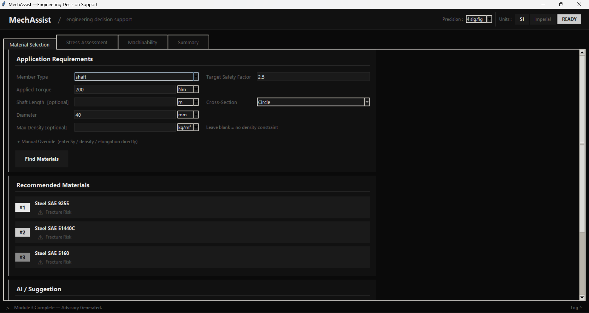

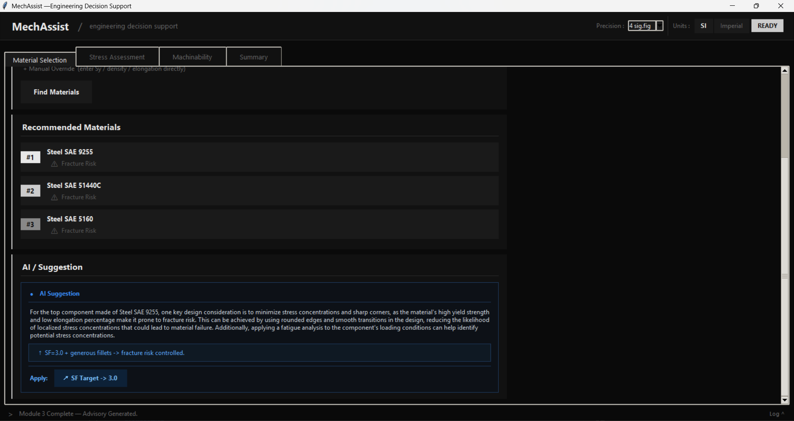

---

**Module 2 — Stress Assessment**
Shaft Torsion Tool computes shear stress from torque and diameter, auto-fills the stress fields below, then the RF classifier assesses the combined stress state.

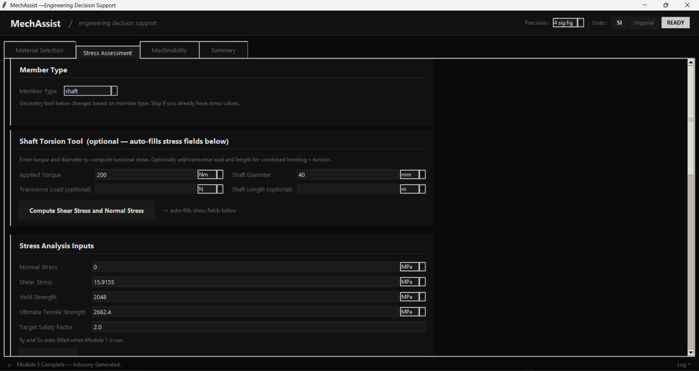

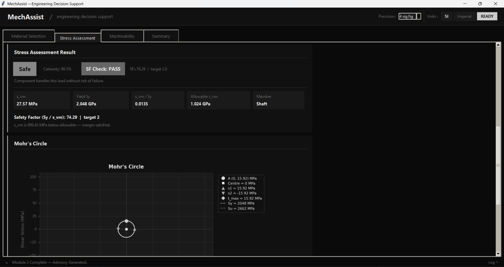

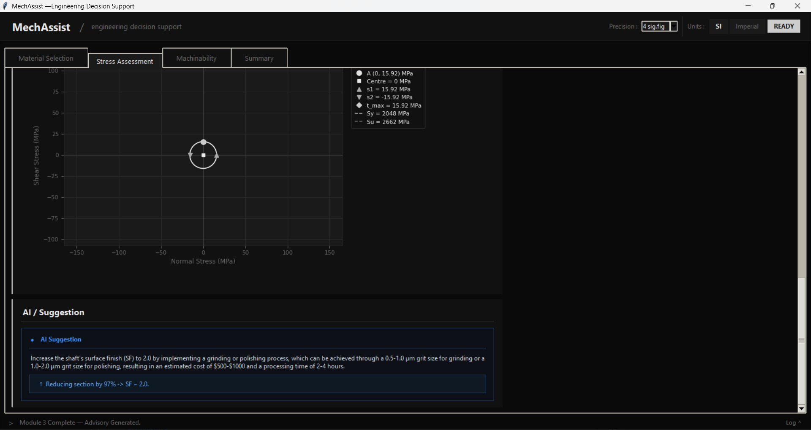

---

**Module 3 — Machinability Advisory**
Machine: HMT NH26 lathe. Tool: Carbide. Parameters auto-filled from M1, capped to machine limits (max 120 m/min, 1800 rpm, 800 Nm).

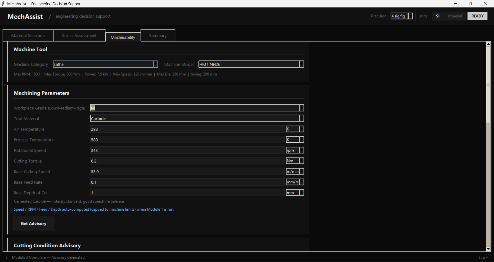

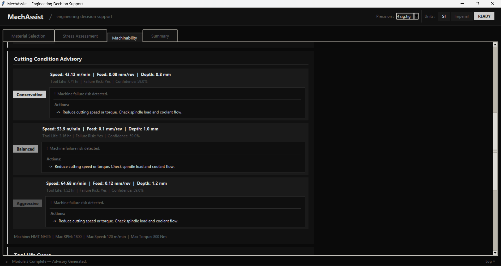

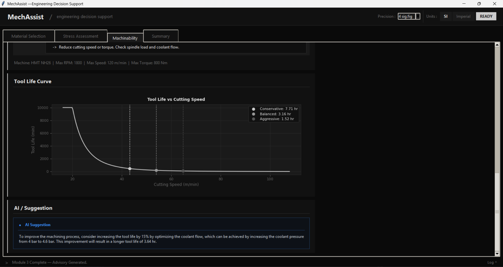

---

**Summary and PDF Export**

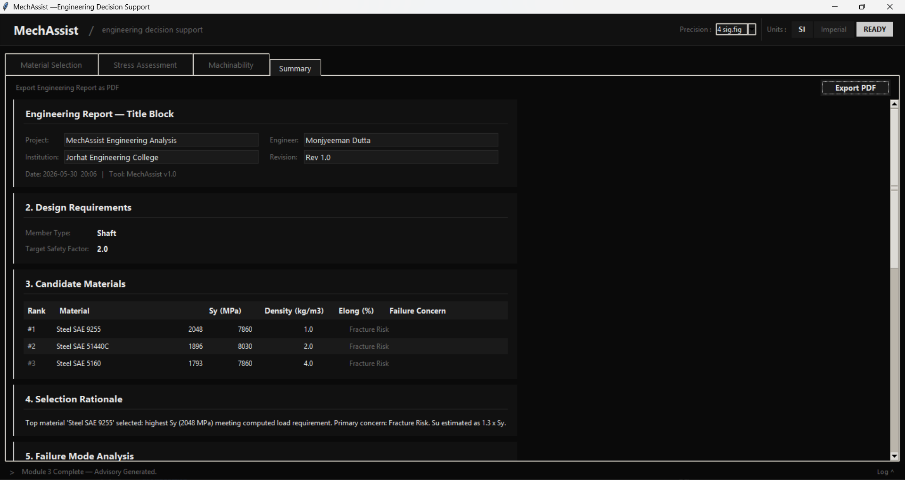

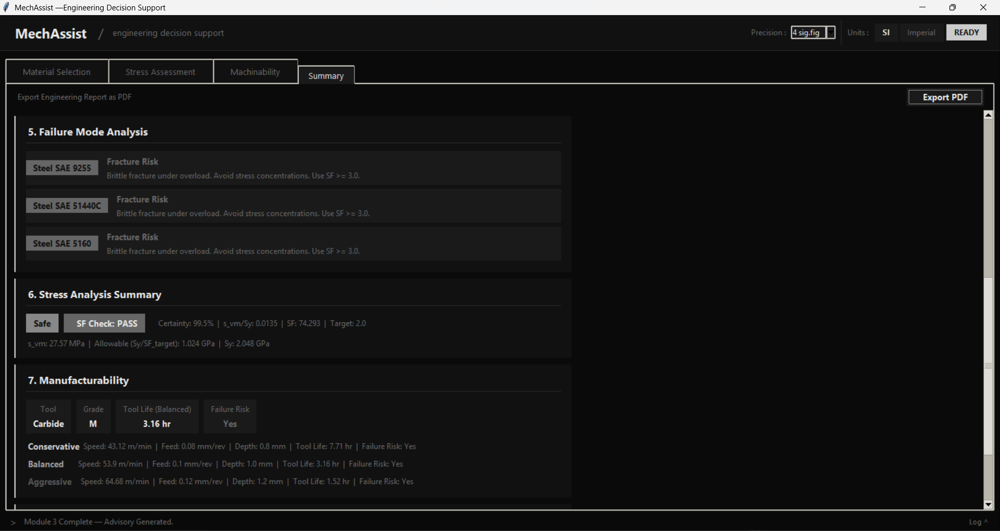
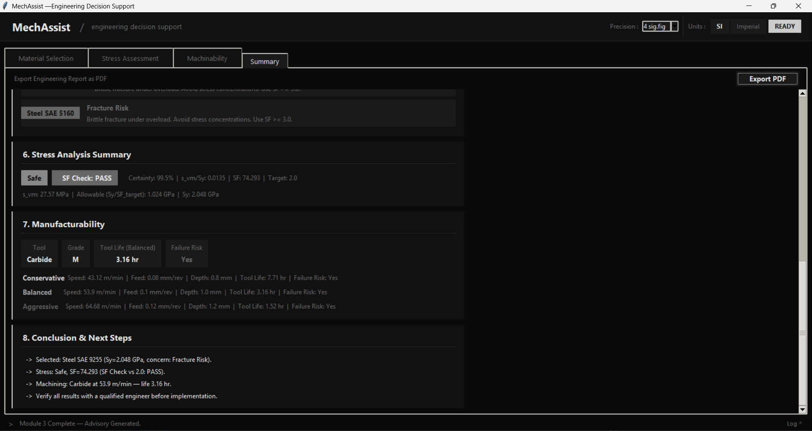

The PDF export button on the Summary tab generates a full A4 engineering report with Mohr's Circle and tool life curve embedded. A sample output from the test case above is in [`sample_report/MechAssist_Engineering_Analysis.pdf`](sample_report/MechAssist_Engineering_Analysis.pdf).

---

## Features

**Module 1 — Material Selection**
- Application-driven inputs: member type (beam / shaft / column / plate), applied load or torque, geometry, and target safety factor
- Computes required yield strength from first principles — `tau = 16T / (pi * d^3)` for shafts, bending + shear for beams, axial for columns
- Filters a 1552-row material dataset using K-Means clustering (k=6)
- Returns ranked candidates with failure concern classification (Fracture / Fatigue / Creep)
- Manual override available for direct Sy / density / elongation input
- AI suggestion via Groq API (llama-3.1-8b-instant)

**Module 2 — Stress Assessment**
- Member type selector switches the geometry tool shown: beam tool for beams and plates, shaft torsion tool for shafts, axial info card for columns
- Beam Geometry Tool: Rectangle or circular section, point load or UDL, simply supported. Plots SFD, BMD and deflection curve. Auto-fills stress fields.
- Shaft Torsion Tool: Computes `tau = 16T / (pi * d^3)`, optional combined bending via `sigma = 32M / (pi * d^3)` for transverse load + length input. Auto-fills stress fields.
- Random Forest classifier (200 estimators, 93% accuracy, 5 risk classes: Safe / Yield Risk / Fatigue Risk / Fracture Risk / Buckling Risk) trained on 36,000 samples
- Von Mises stress, safety factor check (PASS/FAIL), allowable stress display
- Interactive Mohr's Circle with principal stresses, max shear, Sy and Su reference lines
- AI suggestion with one-click Apply buttons that write values back to input fields

**Module 3 — Machinability Advisory**
- Machine tool selector: Category (Lathe / VMC / HMC / CNC Machining Centre / Drill Press / Grinding Machine) and model (HMT, Kirloskar, ACE, BFW, Haas, Mazak, DMG Mori, Okuma)
- Machine spec display: Max RPM, torque, power, speed, workpiece diameter
- Auto-fills speed, RPM, feed, depth, and torque from M1 output, capped to selected machine limits
- Soft warnings if any parameter exceeds machine capacity
- Taylor tool life equation with grade multipliers per tool material (HSS / Carbide / Ceramic / CBN)
- Three cutting modes: Conservative (0.8x), Balanced (1.0x), Aggressive (1.2x, capped at 500 m/min)
- Random Forest failure classifier trained on the AI4I 2020 dataset
- Tool life curve plot (Taylor equation, all three modes marked)

**Cross-module workflow**
- M1 auto-fills Sy, Su, E into M2 on run
- M1 auto-fills grade, speed, RPM, feed, depth, torque into M3 on run, respecting selected machine limits
- M2 re-triggers M3 auto-compute after stress assessment

**UI and output**
- SI / Imperial unit toggle — values convert in-place across all entries
- Precision selector: 2 to 6 significant figures
- Tooltips on every input with typical ranges and formula references
- Activity log panel with colour-coded entries, 200-entry rolling buffer
- PDF export: A4, header/footer every page, Mohr's Circle and tool life curve embedded, full narrative

---

## Tech Stack

| Layer | Library |
|---|---|
| GUI | Tkinter |
| ML — clustering | scikit-learn KMeans |
| ML — stress classifier | scikit-learn RandomForestClassifier |
| ML — failure classifier | scikit-learn RandomForestClassifier |
| Data | pandas, NumPy |
| Plots | Matplotlib |
| Model persistence | joblib |
| PDF export | ReportLab |
| AI suggestions | Groq API  |

Python 3.14. Tested on Windows 11.

---

## Installation

```bash
git clone https://github.com/Anzai004/MechAssist.git
cd MechAssist

python -m venv venv
venv\Scripts\activate          # Windows
# source venv/bin/activate     # Linux / macOS

pip install scikit-learn pandas numpy matplotlib joblib reportlab requests
```

---

## Running

```bash
venv\Scripts\activate
python gui/app.py
```

---

## File Structure

```
MechAssist/
├── data/
│   ├── module1/Material Selection/Data.csv   # 1552 materials, 15 properties
│   ├── module2/stress_data.csv               # 36,000 training samples
│   └── module3/ai4i2020.csv                  # AI4I 2020 machining dataset
├── data_generators/
│   ├── generate_stress_data.py
│   ├── machine_specs.py                      
│   └── taylor_tool_life.py
├── gui/
│   └── app.py                                
├── models/
│   ├── kmeans_module1.pkl
│   ├── scaler_module1.pkl
│   ├── rf_module2.pkl
│   ├── encoder_module2.pkl
│   └── rf_module3_clf.pkl
├── modules/
│   ├── module1_material.py
│   ├── module2_stress.py
│   └── module3_machining.py
├── utils/
│   ├── __init__.py
│   └── export_pdf.py
└── sample_report/
    └── MechAssist_Engineering_Analysis.pdf
```

---

## Sample Output

Test case: shaft, T = 200 Nm, d = 40 mm, SF = 2.5, Carbide on HMT NH26.

| | Result |
|---|---|
| Top material | Steel SAE 9255, Sy = 2048 MPa |
| Von Mises stress | 27.57 MPa |
| Safety factor | 74.29 (target 2.0, PASS) |
| Stress ratio | 0.0135 |
| Tool life (balanced) | 3.16 hr at 53.9 m/min |

---

## Known Limitations

- Beam tool: simply supported only, point load and UDL only
- Su auto-estimated as 1.3 x Sy — verify against datasheet for critical designs
- Fatigue Risk class underrepresented in M2 training data (2096 / 36000 samples)
- Temperature inputs use manual unit conversion, not the UnitEntry widget
- Aggressive cutting speed capped at 500 m/min
- All results are advisory. Verify with a qualified engineer before use in a real design.

---

## License

MIT